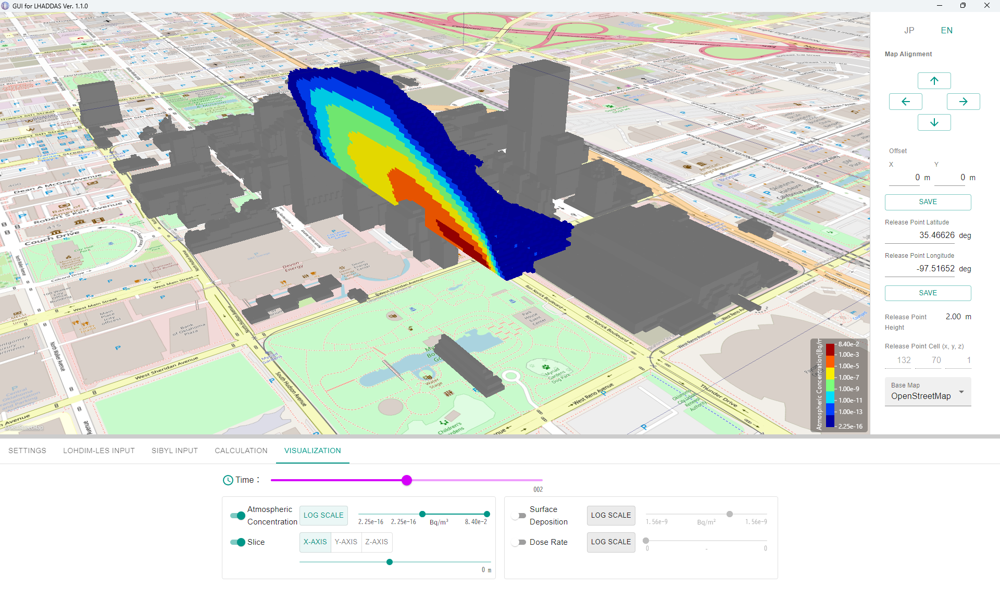
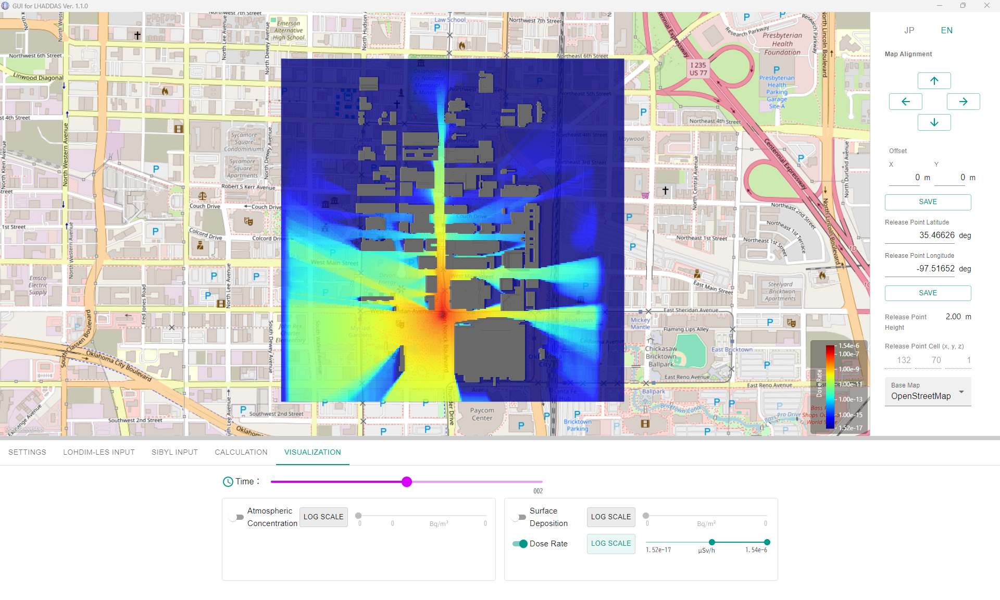

# GUI-LHADDAS

[](https://doi.org/10.5281/zenodo.21273704)

GUI-LHADDAS is a Graphical User Interface (GUI) application for **LHADDAS**, a system that integrates the high-resolution atmospheric dispersion calculation code "**LOHDIM-LES**" and the dose evaluation code "**SIBYL**".

This application allows you to seamlessly configure complex input parameters and execute calculations without relying on the command line. It also provides intuitive 3D map visualization and analysis of the simulation results (Atmospheric Concentration, Surface Deposition Concentration, Dose Rate, etc.).

<p align="center">
  
  <br>
  <em>3D atmospheric concentration through the Oklahoma City street network.</em>
</p>
<p align="center">
  
  <br>
  <em>Ground-level dose-rate distribution, showing shielding effects behind buildings.</em>
</p>

## Main Features

* **Integrated Execution of Calculation Engines**
  * Specify the executable files and input folders for LOHDIM-LES and SIBYL to directly run calculations from the GUI.
  * Setup and generate the necessary input files for LOHDIM-LES and SIBYL directly within the GUI.
  * Set the release point by simply clicking on the map to retrieve its latitude and longitude.
* **3D Map Result Visualization (Powered by Cesium)**
  * Overlay calculation results on the map, including Atmospheric Concentration (3D), Surface Deposition Concentration (2D), and Dose Rate (2D).
  * Utilize map tiles such as GSI Maps (Geospatial Information Authority of Japan) and OpenStreetMap as background layers.
  * Manipulate sliders to view cross-sectional slices along any axis (X, Y, Z) and simulate concentration changes over time using sequential output files.
  * View numerical values for Surface Deposition Concentration and Dose Rate at specific locations via mouse hover.

## System Requirements

This software is compatible with the following multi-platform environments:

* **Windows**: Windows 11 (23H2) / x64
* **macOS**: macOS Sequoia (15.3) / Apple Silicon (e.g., M2)
* **Linux**: Ubuntu 24.04 / x64

## Technology Stack

* **Framework**: [Electron](https://www.electronjs.org/) + [React](https://reactjs.org/) + [Vite](https://vitejs.dev/)
* **Language**: TypeScript
* **UI Components**: [Material-UI (MUI)](https://mui.com/)
* **State Management**: [Jotai](https://jotai.org/)
* **3D Visualization / GIS**: [CesiumJS](https://cesium.com/) / [Resium](https://resium.reearth.io/)

## Documentation

The full user manual is available at [docs/GUI-LHADDAS_UserManual.pdf](./docs/GUI-LHADDAS_UserManual.pdf).

## Installation

Pre-built installers for Windows, macOS, and Linux are published on the [GitHub Releases](https://github.com/satoh-daiki/GUI-LHADDAS/releases) page. Download the package for your platform and run it; building from source is only required for development (see below).

## Prerequisites for Running Simulations

GUI-LHADDAS orchestrates LOHDIM-LES and SIBYL but does not bundle them, since they are distributed under separate terms (see License below). Obtain them separately and place them as described in:

* [`LOHDIM-LES/README.md`](./LOHDIM-LES/README.md)
* [`SIBYL/README.md`](./SIBYL/README.md)

Sample input/output data sets to try the workflow without running your own calculations are distributed via [GitHub Releases](https://github.com/satoh-daiki/GUI-LHADDAS/releases); see [`examples/README.md`](./examples/README.md) for download and setup instructions.

## Repository Structure

| Directory | Description |
| --- | --- |
| `app/` | Electron application source code (GUI-LHADDAS itself) |
| `LOHDIM-LES/` | Placeholder for the separately obtained LOHDIM-LES executable |
| `SIBYL/` | Placeholder for the separately obtained SIBYL executable |
| `examples/` | Sample input/output data sets |
| `docs/` | User manual and related documentation |

## Development and Build Instructions

The application source code is located in `app/src`. `package.json` is located in `app`, so run the following commands from there.

```bash
cd app
npm install
```

Before building (see below), a known issue in `vite-plugin-cesium` must be patched. Open `node_modules/vite-plugin-cesium/dist/index.mjs`, locate lines 33-37, and comment out the `path.join` call:

```diff
 if (c.root !== void 0) {
-  outDir = path.join(c.root, c.build.outDir);
+  // outDir = path.join(c.root, c.build.outDir);
+  outDir = c.build.outDir;
 } else {
   outDir = c.build.outDir;
 }
```

### Starting Development Mode
```bash
npm run dev
```

### Packaging and Building

Build installers and executables for each platform.

```bash
# Build for Windows (Output: .exe installer)
npm run build:win

# Build for macOS (Output: .dmg)
# * Distribution to other environments requires Notarization using an Apple Developer ID.
npm run build:mac

# Build for Linux (Output: .AppImage)
npm run build:linux
```

## Citation

If you use GUI-LHADDAS in your work, please cite:

> Satoh, D., Nakayama, H., & Kadowaki, M. (2026). GUI-LHADDAS (v1.1.0). Zenodo. [https://doi.org/10.5281/zenodo.21273705](https://doi.org/10.5281/zenodo.21273705)

## References

* **LHADDAS**
  H. Nakayama, N. Onodera, D. Satoh, H. Nagai, Y. Hasegawa, Y. Idomura,
  "Development of local-scale high-resolution atmospheric dispersion and dose assessment system",
  *Journal of Nuclear Science and Technology*, pp. 1314–1329, 2022.
  [https://doi.org/10.1080/00223131.2022.2038302](https://doi.org/10.1080/00223131.2022.2038302)

* **LOHDIM-LES**
  H. Nakayama, D. Satoh, H. Nagai, H. Terada,
  "Development of local-scale high-resolution atmospheric dispersion model using large-eddy simulation part 6: introduction of detailed dose calculation method",
  *Journal of Nuclear Science and Technology*, pp. 949–969, 2021.
  [https://doi.org/10.1080/00223131.2021.1894256](https://doi.org/10.1080/00223131.2021.1894256)

* **SIBYL**
  D. Satoh, H. Nakayama, T. Furuta, T. Yoshihiro, K. Sakamoto,
  "Simulation code for estimating external gamma-ray doses from a radioactive plume and contaminated ground using a local-scale atmospheric dispersion model",
  *PLOS ONE*, 2021.
  [https://doi.org/10.1371/journal.pone.0245932](https://doi.org/10.1371/journal.pone.0245932)
  GitHub: [https://github.com/satoh-daiki/SIBYL](https://github.com/satoh-daiki/SIBYL)

## License

The GUI component of this software is released under the **MIT License**. For details, please refer to the [LICENSE.txt](./LICENSE.txt) file.
*Note: The actual calculation codes for LOHDIM-LES and SIBYL are not included in this package and may be subject to separate licenses.*

Copyright (c) 2023-2026 Japan Atomic Energy Agency
